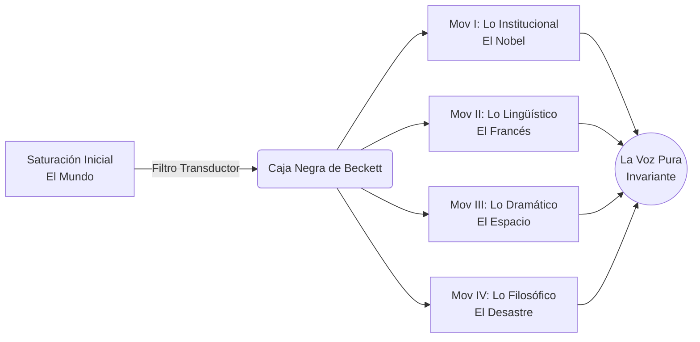
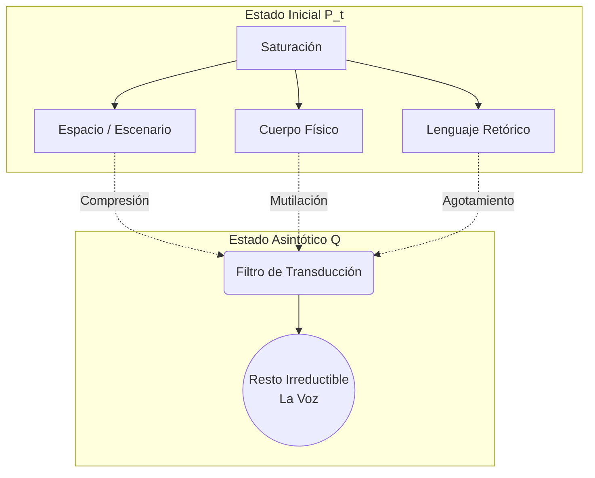

# Introducción General

**Por Borja Fernández Angulo**
*Investigador en Sistemas Complejos*

## 1. El Estado de la Cuestión: El Agotamiento del Absurdo
Durante décadas, la crítica literaria ha confinado la obra de Samuel Beckett bajo etiquetas estériles: el teatro del absurdo, el pesimismo existencial o el nihilismo de posguerra. Esta tesis parte de una premisa radicalmente distinta: estas lecturas tradicionales constituyen un colapso hermenéutico. Beckett no escribe sobre la nada, sino sobre la *resistencia* ante la nada. Su obra es un ejercicio de sustracción extrema donde, al despojar al individuo de sus coordenadas habituales (cuerpo, espacio, lenguaje), emerge un núcleo indestructible.

## 2. Metodología: La Transducción Literaria
Para abordar este corpus, este trabajo abandona las herramientas de la crítica literaria convencional y adopta un enfoque transversal, traducido estrictamente al lenguaje humanístico. Entendemos aquí la escritura de Beckett como un proceso de *transducción*: la transformación de una fuerza masiva externa (el silencio, la catástrofe) en un pulso mínimo pero incesante (la voz que no puede detenerse). Cada capítulo analiza cómo este principio opera en distintas dimensiones de su obra.

## 3. Justificación y Propósito
Esta investigación se forja con un doble propósito. En el plano académico, busca establecer un nuevo canon hermenéutico que devuelva a Beckett su dignidad estructural, rescatándolo del cliché melancólico. En el plano íntimo, este texto es un artefacto de ascesis y rigor forjado expresamente para Diana. Es la demostración empírica de que el rigor analítico más absoluto y la sensibilidad literaria más profunda convergen en el mismo punto de ignición.

## 4. Arquitectura de la Tesis

El recorrido se articula en cuatro movimientos:
1. **La Transducción Institucional:** El análisis del Premio Nobel de 1969 como el reconocimiento a la dignidad emergente en la destitución absoluta.
2. **La Transducción Interlingüística:** La ruptura con Joyce y el uso de la autotraducción como ascesis estilística y vaciado retórico.
3. **La Transducción Dramática:** La compresión del espacio escénico y la reducción del cuerpo hasta su mínima expresión (*Not I*).
4. **El Punto Fijo del Desastre:** La prosa terminal (*Worstward Ho*) y el enfrentamiento con Adorno y Badiou sobre la persistencia del lenguaje.

El viaje no concluye en el silencio, sino en la obstinación de decir.

---
**Firmado:**  
**Borja Fernández Angulo**  
*Investigador en Sistemas Complejos*

# Capítulo 1: La Transducción Institucional
## La Academia Sueca y el Conflicto Hermenéutico del Nobel de 1969

**Por Borja Fernández Angulo**  
*Investigador en Sistemas Complejos*  
*(Tesis para Diana)*

---

### Resumen del Capítulo
Este capítulo examina la recepción institucional de la obra de Samuel Beckett a partir de los protocolos del Comité Nobel de la Academia Sueca correspondientes a los años 1964–1969, desclasificados tras cumplir la regla estatutaria de cincuenta años de secreto. Se demuestra que la concesión del Premio Nobel de Literatura en 1969 no constituyó una asimilación tardía del existencialismo de posguerra ni una capitulación ante el pesimismo finisecular, sino una operación hermenéutica sin precedentes: la reinterpretación del mandato testamentario de Alfred Nobel («en una dirección idealista») no como un juicio sobre el contenido moralizante de la fábula, sino como el reconocimiento de un *morfismo formal sobre lo indestructible*. A través del análisis filológico del dictamen oficial (*utlåtande*), centrado en la antinomia sueca entre *blottställdhet* (desamparo extremo) y *resning* (elevación moral), se fundamenta el concepto de *transducción institucional* como eje metodológico de la tesis.

---

## 1.1. El Mandato Testamentario y su Historia Elástica

El 27 de noviembre de 1895, Alfred Nobel firmó en París el testamento ológrafo que instituía los premios que llevan su nombre. En la cláusula cuarta, el industrial sueco estipuló que una parte del fondo se destinaría al autor que hubiese producido en el campo de las letras «lo más destacado en una dirección idealista» (*«det utmärktaste i idealisk rigtning»*, según la grafía decimonónica del manuscrito).

Desde la primera adjudicación en 1901 al poeta Sully Prudhomme, la cláusula nunca operó como una mera descripción taxonómica, sino como un campo de batalla hermenéutico permanente (Espmark, 1991). Bajo el prolongado magisterio del secretario permanente Carl David af Wirsén (en funciones hasta 1912), la expresión *«i idealisk rigtning»* fue interpretada en un sentido estrictamente confesional y conservador: la literatura debía encarnar una «elevación moral edificante», una armonización del espíritu con los valores teleológicos de la civilización cristiana. Esta criba dogmática provocó la exclusión explícita de León Tolstói —considerado anarquista e iconoclasta por el comité—, así como el rechazo reiterado a Henrik Ibsen y Émile Zola, cuyos retratos del determinismo biológico y social fueron juzgados incompatibles con el idealismo nobileano.

A lo largo del siglo XX, la Academia Sueca se vio obligada a dotar al término de una elasticidad progresiva para no quedar descalificada como oráculo de las letras universales. Hacia mediados de siglo, en buena parte bajo la influencia del poeta y crítico Anders Österling —miembro de la Academia desde 1919 y su secretario permanente entre 1941 y 1964—, la «dirección idealista» se secularizó bajo la rúbrica de una «amplia humanidad» (*en bred mänsklighet*). Gracias a este ensanchamiento de las fronteras conceptuales del premio, pudieron ser incorporados autores de la vanguardia modernista marcados por la fractura, el desasosiego y el pesimismo histórico: Hermann Hesse (1946), T.S. Eliot (1948), William Faulkner (1949) y Albert Camus (1957).

Sin embargo, la candidatura de Samuel Beckett situó la elasticidad de la Academia ante su límite ontológico. La fórmula de Österling soportaba la tragedia clásica, la lamentación elegíaca e incluso la rebelión existencial; lo que no estaba dispuesta a conceder era el procedimiento de la *sustracción pura*: una escritura que no proponía una tesis sobre el mundo, sino que retiraba metódicamente los andamiajes del sentido.

---

## 1.2. La Candidatura Imposible: 1964–1968

La difusión internacional de *En attendant Godot* a partir de su estreno en 1953 en el Théâtre de Babylone y la posterior publicación de la trilogía narrativa (*Molloy*, *Malone meurt*, *L'Innommable*) convirtieron a Beckett en un candidato ineludible a partir de finales de la década de 1950. No obstante, las actas desclasificadas revelan que la candidatura se estrelló durante una década contra la oposición cerrada de Anders Österling, quien tras abandonar la secretaría permanente continuaba presidiendo el Comité Nobel.

En las deliberaciones de 1964 —año en que el galardón fue atribuido y posteriormente rehusado por Jean-Paul Sartre—, Österling consignó su objeción mediante una fórmula involuntariamente beckettiana:

> *«I would almost consider a prize to him as an absurdity in his own style.»*  
> («Consideraría casi un premio para él como una absurdidad en su propio estilo».)  
> (Comité Nobel, Acta de deliberaciones, 1964).

La tautología del rechazo es reveladora: para Österling, otorgar el premio al autor del absurdo constituía un acto absurdo. Cuatro años más tarde, en el informe preceptivo de 1968, Österling consolidó su veto dotándolo de un marco teórico formal:

> *«Regarding Samuel Beckett, unfortunately, I have to maintain my basic doubts as to whether a prize to him is consistent with the spirit of Nobel’s will. Misanthropic satire (of the Swift type) or radical pessimism (of the Leopardi type) has a powerful heart, which in my opinion is lacking in Beckett.»*  
> («Por lo que respecta a Samuel Beckett, lamentablemente he de mantener mis dudas de fondo sobre si un premio para él es conciliable con el espíritu del testamento de Nobel. La sátira misantrópica [del tipo de Swift] o el pesimismo radical [del tipo de Leopardi] poseen un corazón poderoso que, a mi juicio, a Beckett le falta».)  
> (Österling, Dictamen de 1968).

El argumento de Österling no es moralista en un sentido primario. Al convocar a Jonathan Swift y a Giacomo Leopardi, el presidente del comité admite el pesimismo radical y la furia misantrópica dentro del canon de la alta literatura. Su resistencia contra Beckett es estrictamente formal: lo que niega a la obra beckettiana es la presencia de un «órgano central» —el corazón pasional— que convierta la queja en elocuencia moral. En Beckett, la negación se ejecuta con la fría precisión de un bisturí clínico; es un método, no un desahogo lírico. Ese año, el premio recayó en el novelista japonés Yasunari Kawabata, pero en el seno del comité miembros como Eyvind Johnson y Artur Lundkvist comenzaron a señalar que la supuesta frialdad encubría una conmovedora compasión por el sufrimiento de la carne.

---

## 1.3. La Batalla de 1969: Karl Ragnar Gierow y la Redención Hermenéutica

En el otoño de 1969, la discusión final del Comité Nobel —integrado por Anders Österling (presidente), Lars Gyllensten, Eyvind Johnson, Artur Lundkvist y Henry Olsson, con Karl Ragnar Gierow en calidad de secretario permanente— se polarizó entre dos candidaturas antagónicas: la épica de la acción histórica personificada por André Malraux y la poética de la impotencia radical representada por Samuel Beckett.

Österling endureció su postura con la acusación más severa registrada en los anales del premio: sostuvo que la obra beckettiana generaba en el lector

> *«a bottomless contempt for the human condition»*  
> («un desprecio sin fondo por la condición humana»)  
> (Österling, Deliberaciones de 1969).

Y definió la dramaturgia del irlandés como *«artistically staged ghost poetry»* («una poesía fantasmagórica escenificada con oficio»). Sin embargo, en el mismo documento, Österling introdujo una fisura que sellaría su derrota dialéctica: concedió que, bajo los motivos desoladores de esa obra, cabía vislumbrar *«a secret defence of humanity»* («una defensa secreta de la humanidad»).

La admisión de esa «defensa secreta» desplazó la contienda del terreno doctrinal (¿declara la obra valores nobles?) al terreno hermenéutico (¿quién posee el aparato crítico para decodificar la señal?). Karl Ragnar Gierow aprovechó esta brecha para formular la defensa decisiva que volcó la votación en favor de Beckett. Gierow sostuvo que la negrura de Beckett

> *«is not the expression of animosity and nihilism, but of a deep and wounded compassion, depicting humanity at the point of its most severe degradation where its resilience is most astonishing.»*  
> («no es expresión de animosidad y nihilismo, sino de una compasión herida y profunda, que retrata a la humanidad en el punto de su más severa degradación, donde su capacidad de resistencia resulta más asombrosa».)  
> (Gierow, Informe de secretaría, 1969).

---

## 1.4. Filología del Dictamen: De *Blottställdhet* a *Resning*

El 23 de octubre de 1969, la Academia Sueca hizo público el fallo oficial, redactado por Gierow, confiriendo el Premio Nobel de Literatura a Samuel Beckett:

> *«För en diktning som i nya former för roman och drama ur den nutida människans blottställdhet hämtar sin resning.»*  
> («Por una obra que, en nuevas formas para la novela y el drama, obtiene su elevación desde el desamparo del hombre contemporáneo».)  
> (Svenska Akademien, *Nobelkommitténs utlåtande*, 1969).

La fuerza conceptual del dictamen reside en la articulación de dos términos suecos fundamentales cuya tensión define la poética beckettiana:

1. **Blottställdhet:** Derivado del adjetivo *blott* (desnudo, mero, despojado) y del verbo *ställa* (colocar, situar). No alude simplemente a la pobreza o a la escasez material; nombra la **exposición radical**, la vulnerabilidad sin defensa, el estado del ser humano desprovisto de coberturas metafísicas, ilusiones ideológicas o prótesis psicológicas. Es el hombre arrojado a la intemperie absoluta, análogo al despojamiento somático de Vladimir, Estragón o Winnie.
2. **Resning:** Término que abarca polisémicamente la elevación arquitectónica (el alzado de un edificio), el porte erguido del cuerpo humano y la rehabilitación moral o jurídica de un condenado.

La genialidad filológica de Gierow consistió en vincular ambos conceptos mediante la preposición de origen **ur** (*desde*, *a partir de*). La elevación artística y moral (*resning*) no se logra **a pesar** del desamparo (*blottställdhet*), ni mediante una superación dialéctica que clausure el dolor; se obtiene **desde dentro del desamparo mismo**. La honestidad implacable de no desviar la mirada ante la degradación corporal y lingüística es la única condición de posibilidad de la dignidad estética en el siglo XX.

---

## 1.5. Conclusión: El Nobel como Morfismo sobre lo Indestructible

El conflicto institucional de 1969 ilustra con precisión matemática lo que en esta tesis denominamos **transducción**:
- Para Österling, el testamento exigía una literatura que inyectara activamente esperanza en el receptor (modelo aditivo). Al no hallar mensajes reconfortantes en Beckett, diagnosticó ausencia de valor.
- Para Gierow y la mayoría de la Academia, la obra de Beckett operaba como un filtro de máxima selectividad: al despojar a sus personajes de todas las vanidades contingentes (estatus, memoria, destreza motriz), lo que sobrevive en la escena no es la nada, sino **la persistencia pura del decir**.

El premio de 1969 no fue la rendición de la Academia ante el nihilismo, sino el descubrimiento de que la fidelidad incorruptible de un autor que rehúsa mentir constituye la más alta manifestación contemporánea de la «dirección idealista».

---

### Referencias del Capítulo
- **Adorno, Th. W.** (1961). «Versuch, das Endspiel zu verstehen». En *Noten zur Literatur II*. Fráncfort: Suhrkamp. (Trad. esp.: *Notas sobre literatura*, Madrid: Akal, 2003).
- **Beckett, S.** (1952). *En attendant Godot*. París: Éditions de Minuit.
- **Espmark, K.** (1991). *The Nobel Prize in Literature: A Study of the Criteria behind the Choices*. Boston: G.K. Hall & Co.
- **Gierow, K. R.** (1969). *Award Ceremony Speech: The Nobel Prize in Literature 1969*. Estocolmo: Nobel Foundation Archives.
- **Knowlson, J.** (1996). *Damned to Fame: The Life of Samuel Beckett*. Londres: Bloomsbury.
- **Österling, A.** (1964, 1968, 1969). *Nobelkommitténs protokoll och utlåtande*. Estocolmo: Svenska Akademiens Nobelarkiv (desclasificados 2019–2020).
- **Simpson, H.** (2020). «Samuel Beckett and the Nobel Catastrophe». *Oxford Research Archive*.

# Capítulo 2: La Transducción Interlingüística
## La Autotraducción como Ascesis y Filtro de Sustracción

**Por Borja Fernández Angulo**  
*Investigador en Sistemas Complejos*  
*(Tesis para Diana)*

---

### Resumen del Capítulo
Este capítulo investiga el bilingüismo activo y la autotraducción en Samuel Beckett no como una contingencia biográfica o una estrategia editorial de difusión cosmopolita, sino como el dispositivo central de su poética: un *filtro de notch* operado a través del lenguaje que ejecuta una poda deliberada de la inercia retórica heredada. A partir del análisis de la crisis estética de 1946 (la «revelación» del espigón de Dún Laoghaire) y la célebre justificación del abandono del inglés (*«pour m'appauvrir»*), se examina el proceso genético de autotraducción como una doble transducción recurrente. Mediante el cotejo filológico de variantes textuales entre las versiones francesas e inglesas de *En attendant Godot* / *Waiting for Godot* y la trilogía novelística (*Molloy*, *Malone meurt*, *L'Innommable*), se demuestra que la traducción operada por el propio autor no persigue la equivalencia semántica ni la fluidez idiomática, sino el desgaste sistemático del estilo hasta aislar el residuo irreductible de la voz.

---

## 2.1. De la Epifanía Joyceana a la Vía Negativa (Dún Laoghaire, 1946)

La génesis de la madurez literaria de Samuel Beckett está indisociablemente ligada a una ruptura filial con James Joyce. Durante su estancia en París a finales de los años veinte e inicios de los treinta como lector en la École Normale Supérieure, Beckett orbitó en el círculo íntimo del autor de *Ulysses*, colaborando como amanuense en la transcripción de fragmentos de *Work in Progress* (el futuro *Finnegans Wake*) y publicando su temprano ensayo defensivo «Dante... Bruno. Vico.. Joyce» (1929).

La influencia joyceana sobre las primeras obras en prosa de Beckett —en particular la colección de relatos *More Pricks Than Kicks* (1934) y la novela *Murphy* (1938)— resultó sofocante: una prosa sobrecargada de erudición enciclopédica, polifonía léxica, juegos de palabras políglotas y un virtuosismo de raíz isabelina que competía en pirotecnia verbal con su mentor. En una conversación retrospectiva con James Knowlson, Beckett diagnosticó la naturaleza de aquel callejón sin salida estético:

> *«I realized that Joyce had gone as far as one could in the direction of increasing information, which meant adding words, expanding the universe of the text. My way, on the contrary, was in impoverishment, in lack of knowledge and in taking away, in subtracting rather than in adding.»*  
> («Me di cuenta de que Joyce había ido tan lejos como era posible en la dirección de aumentar la información, lo que significaba añadir palabras, expandir el universo del texto. Mi camino, por el contrario, estaba en el empobrecimiento, en la falta de conocimiento y en quitar, en sustraer antes que en añadir».)  
> (Knowlson, 1996, p. 352).

El punto de inflexión biográfico y formal de este viraje se produjo en la noche de tormenta de marzo de 1946 en el espigón del puerto de Dún Laoghaire, al sur de Dublín —un acontecimiento que el propio autor transpondría más tarde a la escena central de *Krapp's Last Tape* (1958)—. Lo que Beckett descubrió no fue una nueva doctrina temática, sino una regla de método negativo: **el rechazo radical del modelo acumulativo y enciclopédico**. Mientras que Joyce operaba como un demiurgo expansivo cuya meta era la omnisciencia y la saturación del espacio verbal, Beckett asumió como territorio propio la impotencia, la ignorancia radical y la sustracción.

---

## 2.2. La Elección del Francés: «Pour m'appauvrir»

Entre 1946 y 1950 —período de fertilidad prodigiosa que el autor denominó retrospectivamente *«the frenzy of writing»* («el frenesí de la escritura»)—, Beckett tomó la decisión sin precedentes de abandonar su lengua materna para redactar directamente en francés las obras que definirían su canon: *Mercier et Camier*, las cuatro *Nouvelles* (*L'Expulsé*, *Le Calmant*, *La Fin*, *Premier Amour*), la trilogía novelesca (*Molloy*, *Malone meurt*, *L'Innommable*) y la pieza teatral *En attendant Godot*.

La explicación habitual de la crítica tradicional atribuyó este cambio a una coquetería vanguardista o al deseo de insertarse en el medio intelectual del París de posguerra. La correspondencia y los testimonios del autor desmienten de raíz esta lectura superficial. Preguntado por su amigo y biógrafo Ludovic Janvier sobre los motivos de este exilio lingüístico, Beckett ofreció una fórmula lapidaria:

> *«Pour m'appauvrir.»*  
> («Para empobrecerme».)  
> (Janvier, 1969, p. 18).

En otra ocasión, interrogado por el crítico Herbert Blau sobre por qué prefería escribir en una lengua que no era la suya, añadió una precisión filológica fundamental:

> *«In French it is easier to write without style.»*  
> («En francés es más fácil escribir sin estilo».)  
> (Blau, 1964, p. 38).

La noción de «escribir sin estilo» debe entenderse en sentido técnico: como la **neutralización del estilo inercial**. En inglés, su lengua nutricia, el peso del canon angloirlandés (Shakespeare, Milton, Swift, Synge, Joyce) impregnaba cada frase de un ritmo automático, una cadencia seductora y un espesor metafórico que se imponía antes de que la mano del autor pudiera calibrarlo. El inglés «sonaba bien» por defecto; ofrecía consuelos poéticos prefabricados.

El francés, por el contrario, era para Beckett una lengua de adquisición académica tardía. Al carecer de la memoria visceral de la infancia en ese idioma, cada sustantivo y cada conjugación verbal exigían una vigilia consciente, un peaje de exactitud gramatical que impedía el desbordamiento lírico. La adopción del francés operó como una **constricción de impedancia**: una camisa de fuerza sintáctica autoimpuesta para erradicar la elocuencia decorativa y obligar a la voz a avanzar a paso ciego.

---

## 2.3. La Práctica de la Autotraducción: El Manuscrito en Eco

Beckett no fue un escritor bilingüe que delegase la traducción de sus libros a especialistas nativos; con escasísimas excepciones en su poesía temprana, **asumió la autotraducción integral de su obra como una fase constitutiva del proceso de creación** (Fitch, 1988). Tras redactar un texto en francés, acometía meses o años después la redacción de la versión inglesa, revisando y transformando la arquitectura original.

La autotraducción beckettiana refuta la teoría clásica de la traducción entendida como transporte de sentido o equivalencia mimética entre un «original» jerárquicamente superior y una «copia» derivada. Al ser el propio autor quien traduce, el texto de llegada no está obligado a rendir pleitesía servil al de partida:

1. **La Divergencia Tonal:** Las versiones no son isomorfas en superficie. La versión francesa de *En attendant Godot* tiende a una mayor sequedad filosófica y cartesiana; la versión inglesa (*Waiting for Godot*, 1954) reintroduce una aspereza rítmica propia del habla dublinesa, cargada de una comicidad física más cortante y desolada.
2. **La Supresión de Retórica:** En el pasaje de una lengua a otra, Beckett utiliza la fricción entre ambos idiomas como una lima sustractiva. Si una imagen o un chiste dependían excesivamente de un juego de palabras intraducible, Beckett no busca un equivalente ingenioso: **lo extirpa**. El tránsito interlingüístico opera como una prueba de resistencia en la que solo se conserva aquello que no depende del ornamento idiomático.
3. **El Bucle Recurrente:** En sus obras tardías (*Bing* / *Ping*, *Le Dépeupleur* / *The Lost Ones*, *Company* / *Compagnie*), el movimiento se invierte o se vuelve circular: redacta primero en inglés para traducir al francés, o compone fragmentos alternos en ambas lenguas simultáneamente. Las dos versiones funcionan como dos espejos enfrentados que disuelven progresivamente la ilusión de una «lengua original».

---

## 2.4. La Lengua como Prótesis y el Residuo Indestructible

El clímax de esta mecánica sustractiva se alcanza en el cierre de la trilogía narrativa con *L'Innommable* (1953) / *The Unnamable* (1958). En este texto, el sujeto de la enunciación ha perdido todo anclaje físico, temporal y espacial: no hay personaje, no hay trama, no hay escenario. Solo queda una voz aprisionada en un monólogo incesante que constata la doble imposibilidad sobre la que pivota toda la obra de Beckett:

> *«...il faut dire des mots, tant qu'il y en a, il faut les dire, jusqu'à ce qu'ils me trouvent, jusqu'à ce qu'ils me disent, étrange peine, étrange faute, il faut continuer, c'est peut-être déjà fait, ils m'ont peut-être déjà dit, ils m'ont peut-être porté jusqu'au seuil de mon histoire, devant la porte qui s'ouvre sur mon histoire, ça m'étonnerait, si elle s'ouvre, ça va être moi, ça va être le silence, là où je suis, je ne sais pas, je ne le saurai jamais, dans le silence on ne sait pas, il faut continuer, je ne peux pas continuer, je vais continuer.»*  
> (Beckett, *L'Innommable*, 1953, pp. 213–214).

Y en su propia versión inglesa:

> *«...you must say words, as long as there are any, until they find me, until they say me, strange pain, strange sin, you must go on, perhaps it's done already, perhaps they have said me already, perhaps they have carried me to the threshold of my story, before the door that opens on my story, that would surprise me, if it opens, it will be I, it will be the silence, where I am, I don't know, I'll never know, in the silence you don't know, you must go on, I can't go on, I'll go on.»*  
> (Beckett, *The Unnamable*, 1958, p. 414).

La autotraducción pone aquí de manifiesto su verdad terminal: el lenguaje es una prótesis defectuosa, una sustancia extraña que nunca logra apresar la identidad del hablante, pero que al mismo tiempo constituye el único medio a través del cual la existencia puede ser atestiguada.

Al despojar al inglés de su música y forzar al francés a operar en su hueso sintáctico más austero, el transductor beckettiano logra aislar la cantidad conservada bajo toda degradación: **la aporía irresoluble entre el colapso del cuerpo y la persistencia obligatoria del decir.**

---

### Referencias del Capítulo
- **Beckett, S.** (1929). «Dante... Bruno. Vico.. Joyce». En *Our Exagmination Round His Factification for Incamination of Work in Progress*. París: Shakespeare and Company.
- **Beckett, S.** (1953). *L'Innommable*. París: Éditions de Minuit.
- **Beckett, S.** (1958). *The Unnamable*. Nueva York: Grove Press.
- **Beckett, S.** (1983). *Disjecta: Miscellaneous Writings and a Dramatic Fragment*. Ed. Ruby Cohn. Londres: John Calder.
- **Blau, H.** (1964). *The Impossible Theater: A Manifesto*. Nueva York: Macmillan.
- **Cohn, R.** (2001). *A Beckett Canon*. Ann Arbor: University of Michigan Press.
- **Connor, S.** (1988). *Samuel Beckett: Repetition, Theory and Text*. Oxford: Basil Blackwell.
- **Federman, R.** (1965). *Journey to Chaos: Samuel Beckett's Early Fiction*. Berkeley: University of California Press.
- **Fitch, B. T.** (1988). *Beckett and Babel: An Investigation into the Status of the Bilingual Work*. Toronto: University of Toronto Press.
- **Janvier, L.** (1969). *Pour Samuel Beckett*. París: Éditions de Minuit.
- **Knowlson, J.** (1996). *Damned to Fame: The Life of Samuel Beckett*. Londres: Bloomsbury.

# Capítulo 3: La Transducción Dramática
## De la Pantomima a la Boca: Contracción Geométrica del Espacio y Reducción del Cuerpo

**Por Borja Fernández Angulo**  
*Investigador en Sistemas Complejos*  
*(Tesis para Diana)*

---

### Resumen del Capítulo
Este capítulo examina la evolución de la dramaturgia beckettiana como un proceso continuo de contracción espacial y desmantelamiento anatómico. Lejos de constituir una abstracción metafísica desvinculada de la escena real, el teatro de Samuel Beckett hunde sus raíces en la comedia física popular —el vodevil, el *music-hall* victoriano y el cine mudo de Buster Keaton y Charles Chaplin—, donde el sufrimiento no se sublima en tragedia lírica, sino que se expone en la mecánica torpe y dolorosa del cuerpo biológico. A través del análisis diacrónico que recorre la apertura espacial de *En attendant Godot* (1953), la claustrofobia estática de *Fin de partie* (1957), la sepultura paulatina de *Happy Days* (1961) y la disolución somática terminal en *Not I* (1972), se demuestra que la escena beckettiana opera como un transductor físico: reduce metódicamente los grados de libertad del actor hasta aislar el órgano fonador como el último resto en insumisión frente a la oscuridad. El capítulo concluye con el estudio de los cuadernos de dirección (*theatrical notebooks*) del Schiller Theater de Berlín, que acreditan la concepción de la puesta en escena no como interpretación psicológica, sino como partitura geométrica y temporal de precisión milimétrica.

---

## 3.1. El Cuerpo en el Límite: Del Music-Hall y el Slapstick a la Desacralización Teatral

La recepción académica del teatro de Beckett ha padecido con frecuencia una sobreinterpretación teológica o existencialista que ignora la deuda originaria del dramaturgo con las formas más populares de la comedia física. Antes de concebir a Vladimir y Estragón como arquetipos de la angustia contemporánea, Beckett los modeló a imagen y semejanza de los dúos de payasos de circo y los vagabundos del cine mudo: la pareja cómica asimétrica (el gordo y el flaco, el torpe y el resignado) cuya supervivencia depende de una interdependencia grotesca.

En *En attendant Godot*, el absurdo no se formula mediante tesis filosóficas declamadas; se encarna en la **fricción inmediata de la materia corporal**:
- A Estragón le torturan unas botas demasiado estrechas que deforman sus pies; la dificultad para descalzarse ocupa los primeros minutos de la obra en una secuencia de forcejeo puramente pantomímico.
- A Vladimir le atormenta una afección prostática que le obliga a caminar con pasos cortos y rígidos, con las piernas abiertas, y que interrumpe cualquier conato de risa con una mueca súbita de dolor físico.
- El gag canónico del Acto II en el que Vladimir y Estragón intercambian tres sombreros entre dos cabezas —probándose sucesivamente el propio, el ajeno y el de Lucky en una coreografía circular de confusión vertiginosa— es una transcripción exacta del *hat trick* clásico del vodevil anglosajón.
- La escena final, en la que a Estragón se le caen los pantalones al suelo al desatarse la cuerda del cinturón para intentar ahorcarse de la rama del árbol raquítico, clausura la pieza no con un réquiem fúnebre, sino con la imagen ridícula y conmovedora de unos calzoncillos caídos.

La función estética de esta comedia corporal es la **desacralización instantánea**. Al anclar la existencia en la flatulencia, el olor a pies, el aliento fétido y la torpeza motriz, Beckett bloquea cualquier fuga hacia la retórica solemne. El cuerpo en Beckett no es el templo del espíritu ni el vehículo del heroísmo trágico: es un actuador biológico defectuoso, desgastado por la gravedad, cuya persistencia cómica ante el dolor desarma toda pretensión de trascendencia.

---

## 3.2. La Contracción Espacial y la Asfixia Escénica: De *Godot* a *Happy Days*

Si en *En attendant Godot* el espacio dramático conserva todavía la ilusión de la apertura —un camino de campo, una franja de cielo, un árbol y la posibilidad teórica de marcharse, aunque la acotación final constate la inmovilidad (*«Ils ne bougent pas»*)—, las obras inmediatamente posteriores ejecutan una **contracción geométrica asfixiante** que confina a los personajes en arquitecturas de encierro estricto:

### *Fin de partie* (1957): El Refugio Terminal
El espacio se reduce a una habitación cúbica con dos pequeñas ventanas altas que dan a un mar muerto y a una tierra estéril. Dentro de esta cámara hermética, la movilidad se fragmenta en roles mecánicos complementarios e incompatibles:
- **Hamm:** Ocupa el centroide exacto del escenario, ciego e inmóvil en un sillón de ruedas. Es el soberano paralítico que exige ser devuelto constantemente al «centro absoluto» de la habitación, incapaz de valerse por sí mismo pero ejerciendo un dominio tiránico sobre el espacio sonoro.
- **Clov:** Condenado a una motricidad espasmódica y continua: no puede sentarse jamás. Pasa la obra subiendo y bajando de una escalerilla para otear el exterior con un catalejo, transportando objetos en una trayectoria fija entre la cocina y el sillón.
- **Nagg y Nell:** Los progenitores desprovistos de extremidades inferiores, confinados en dos cubos de basura metálicos de los que solo emergen sus cabezas cubiertas con gorros de dormir para mendigar galletas rancias o rememorar un accidente en tándem en las Ardenas.

La economía escénica de *Fin de partie* ilustra la degradación irreversible: los recursos se agotan sin reposición posible (no quedan analgésicos, no quedan ataúdes, no quedan ruedas para el sillón), pero la partida de ajedrez entre amo y criado no puede concluir.

### *Happy Days* (1961): La Sepultura Geológica
La contracción del cuerpo abandona el mueble carcelario para convertirse en inmersión mineral directa. En un escenario dominado por una luz cegadora y un calor abrasador:
- En el **Acto I**, Winnie se encuentra enterrada en un montículo de tierra hasta la cintura. Mantiene la movilidad del torso y los brazos, desplegando un inventario minucioso de su bolso de mano (un cepillo de dientes, un espejo roto, un revólver, una sombrilla).
- En el **Acto II**, la tierra la ha engullido hasta el cuello. Inmovilizada la cabeza, desprovista de las manos y de los objetos auxiliares, solo le quedan los ojos —que apenas pueden girar para vislumbrar a Willie arrastrándose a sus espaldas— y la boca.

A pesar de la asfixia geológica que avanza, Winnie proclama con obstinada disciplina que este es «otro día feliz». La reducción espacial no anula la piedad del personaje; expone la paradoja de una resiliencia que se sostiene exclusivamente sobre la música del lenguaje ordinario cuando todo soporte físico ha sido devorado.

---

## 3.3. La Desaparición del Soporte Anatómico: *Krapp's Last Tape* y *Not I*

En la dramaturgia tardía de Beckett, el cuerpo del actor deja de ser el centro de la acción para convertirse en un residuo que estorba la emisión de la voz:

### *Krapp's Last Tape* (1958): El Sujeto como Archivo Analógico
Krapp, un anciano decrépito con adicción al alcohol y a los plátanos, celebra su sexagésimo noveno cumpleaños escuchando las grabaciones que él mismo realizó treinta años atrás en una máquina de bobina abierta. El drama se desplaza de la interacción entre cuerpos presentes a la colisión física entre la voz grabada del joven arrogante y el silencio del viejo que rebobina, adelanta y detiene la cinta magnética. La memoria no es una facultad interior del alma; es un carrete de celuloide que gira en la penumbra. El cuerpo vivo opera como mero operador mecánico de un archivo sonoro que documenta la pérdida de todo lo que alguna vez amó.

### *Not I* (1972): La Reducción Terminal a la Boca
Con *Not I*, Beckett alcanza el límite formal de su proyecto dramático:
- El cuerpo humano ha sido suprimido por completo del campo visual.
- El escenario entero permanece en tinieblas absolutas.
- A dos metros y medio de altura respecto al suelo, un haz de luz microscópico ilumina exclusivamente **una boca humana en movimiento frenético**.
- Una actriz (en el estreno histórico, Billie Whitelaw) debe permanecer inmóvil, atada a una estructura rígida en la oscuridad, emitiendo un flujo ininterrumpido de palabras a una velocidad que roza el colapso respiratorio (cerca de 200 palabras por minuto durante catorce minutos).

La boca de *Not I* es el transductor llevado a su grado cero: despojada de rostro, de mirada, de brazos y de identidad jurídica —la voz insiste en tercera persona, negándose visceralmente a pronunciar el pronombre «yo» (*«what?.. who?.. no!.. she!..»*)—, la emisión acústica se revela como un fenómeno puramente involuntario. La voz no expresa un pensamiento previo: es un espasmo biológico, una necesidad muscular inextinguible que continúa funcionando cuando la persona ha sido abolida.

---

## 3.4. La Dirección Teatral como Partitura Geométrica y Cinemática

La faceta de Beckett como director de sus propios montajes entre 1967 y 1979 —fundamentalmente al frente del Schiller Theater Werkstatt de Berlín— refuta de forma definitiva la concepción del teatro del absurdo como improvisación libre o caos gestual (Gontarski, 1999).

Los cuadernos de dirección (*theatrical notebooks*) conservados en los archivos documentan una aproximación escénica equiparable a la de un compositor o un matemático:
1. **La Temporalidad Cronometrada:** Las acotaciones no sugieren estados de ánimo («con tristeza», «con duda»); dictan pausas con duración en segundos (*«Pause: 3 sec. Silence: 5 sec.»*).
2. **La Cinemática de los Pasos:** En su puesta en escena de *Endspiel* (Berlín, 1967) o de *Footfalls* (Londres, 1976), Beckett trazaba diagramas milimétricos en el suelo. En *Footfalls*, la protagonista May debe recorrer exactamente siete pasos a la izquierda, girar, pausar, y recorrer siete pasos a la derecha, sincronizando el impacto del talón contra las tablas del escenario con la cadencia de la respiración.
3. **La Iluminación como Escultura Dinámica:** La luz no cumple una función ambiental; es un bisturí que recorta zonas del espacio escénico. En *Play* (1963), el foco de luz interroga sucesivamente a tres cabezas que emergen de tres urnas funerarias: solo el personaje alcanzado por el rayo tiene permiso para hablar; cuando el foco se apaga, la voz se corta en seco a mitad de una frase.

El teatro de Beckett, en su culminación escénica, se define como una **máquina rítmica de precisión implacable**. Al retirar la psicología, el decorado realista y la elocuencia dramática, el escenario se transforma en un espacio de prueba de laboratorio: un recinto despojado donde se comprueba qué permanece en el ser humano cuando la gravedad, el tiempo y la luz han hecho su trabajo de demolición.

---

### Referencias del Capítulo
- **Beckett, S.** (1953). *En attendant Godot*. París: Éditions de Minuit.
- **Beckett, S.** (1957). *Fin de partie*. París: Éditions de Minuit.
- **Beckett, S.** (1958). *Krapp's Last Tape*. Londres: Faber and Faber.
- **Beckett, S.** (1961). *Happy Days*. Nueva York: Grove Press.
- **Beckett, S.** (1973). *Not I*. Londres: Faber and Faber.
- **Gontarski, S. E.** (Ed.). (1999). *The Theatrical Notebooks of Samuel Beckett, Vol. II: Endgame*. Londres: Faber and Faber.
- **Kalb, J.** (1989). *Beckett in Performance*. Cambridge: Cambridge University Press.
- **Knowlson, J.** (1996). *Damned to Fame: The Life of Samuel Beckett*. Londres: Bloomsbury.
- **Whitelaw, B.** (1995). *Billie Whitelaw... Who He?*. Londres: Hodder & Stoughton.
- **Worton, M.** (1994). «Waiting for Godot and Endgame: Theatre as Challenge». En J. Pilling (Ed.), *The Cambridge Companion to Beckett*. Cambridge: Cambridge University Press.

# Capítulo 4: El Punto Fijo del Desastre
## Más Allá del Nihilismo: La Persistencia del Decir y la Dignidad como Invariante

**Por Borja Fernández Angulo**  
*Investigador en Sistemas Complejos*  
*(Tesis para Diana)*

---

### Resumen del Capítulo
Este capítulo culmina la arquitectura de la tesis examinando la dimensión filosófica y ética de la poética de Samuel Beckett, situándola más allá de la antinomia clásica entre el nihilismo catastrófico y el rescate humanista edificante. A través de la confrontación crítica entre la lectura de Theodor W. Adorno —para quien *Fin de partida* certifica la clausura de la historia y la descomposición del sujeto burgués tras Auschwitz— y la interpretación de Alain Badiou —que postula un «deseo indestructible» y una fidelidad genérica a la humanidad en la obra tardía—, se demuestra que Beckett rehúsa tanto la queja metafísica como la reconciliación moral. A partir del análisis formal de la aporía terminal de *L'Innommable* (*«je ne peux pas continuer, je vais continuer»* / *«I can't go on, I'll go on»*) y la disciplina del fracaso en *Worstward Ho* (1983), se fundamenta la conclusión general de la investigación: el transductor beckettiano somete la existencia a un proceso de despojamiento extremo no para proclamar la nada, sino para aislar la cantidad conservada bajo toda degradación: la dignidad irreducible de una voz que, habiendo perdido todas las justificaciones para hablar, persevera en el decir.

---

## 4.1. La Disputa Filosófica: Entre la Catástrofe de Adorno y el Deseo Indestructible de Badiou

La obra de Samuel Beckett ha sido un imán constante para la filosofía de la segunda mitad del siglo XX, provocando lecturas teóricas que a menudo han intentado asimilar su radicalidad a marcos doctrinales ajenos. En ese debate destacan dos posiciones antagónicas y fundamentales:

### Theodor W. Adorno y la Negatividad Absoluta
En su célebre ensayo de 1961, «Versuch, das Endspiel zu verstehen» («Intento de entender *Fin de partida*»), incorporado a *Notas sobre literatura*, Adorno erigió a Beckett en el único testigo legítimo de la catástrofe de la modernidad occidental. Para el teórico frankfurtiano:
- La obra de Beckett no es una fábula atemporal sobre la condición humana, sino el sismógrafo exacto de la experiencia posterior a Auschwitz y a la bomba atómica.
- *Fin de partida* constata la muerte del sentido, la mutilación de la subjetividad autónoma y la transformación de la historia en un vertedero estático:
  > *«Nach Auschwitz gibt es kein Wort mehr des Trostes... Das Endspiel geht von der vollendeten Katastrophe aus.»*  
  > («Después de Auschwitz ya no queda palabra de consuelo... *Fin de partida* parte de la catástrofe consumada».)  
  > (Adorno, 1961/2003, p. 284).
- Para Adorno, cualquier intento de encontrar un mensaje positivo o una moraleja humanista en Beckett constituye una obscenidad ideológica, un intento burgués de reconciliarse con lo irreconciliable. La grandeza de Beckett residiría en su negativa inflexible a ofrecer consuelo.

### Alain Badiou y la Insumisión Genérica
En las antípodas de la lectura adorniana, Alain Badiou publicó en 1995 *Beckett: L'increvable désir* (*Beckett: el deseo indestructible*), desafiando frontalmente la etiqueta del pesimismo nihilista. Para Badiou:
- Reducir a Beckett al absurdo, a la desesperanza y al duelo de posguerra es un malentendido de proporciones colosales heredado de la pereza existencialista.
- La obra de Beckett no es una elegía sobre la decadencia del hombre, sino una **indagación ascética sobre lo genérico de la humanidad**:
  > *«Beckett n'est nullement le chantre du désespoir ou de l'absurde. Il est le penseur obstiné de ce qui résiste à toute destruction, de la fidélité nue à l'événement de la parole et de la rencontre.»*  
  > («Beckett no es en modo alguno el cantor de la desesperanza o del absurdo. Es el pensador obstinado de lo que resiste a toda destrucción, de la fidelidad desnuda al acontecimiento de la palabra y del encuentro».)  
  > (Badiou, 1995, p. 12).
- Badiou subraya que los personajes de Beckett jamás se rinden: Vladimir y Estragón se esperan; Hamm y Clov no consuman la separación; Winnie celebra la luz; las criaturas de la prosa tardía persisten en la tiniebla.

### La Postura de la Tesis: El Transductor más allá del Eje Optimismo / Pesimismo
La investigación de Diana propone superar la polaridad entre la catástrofe de Adorno y el heroísmo de Badiou demostrando que **el eje optimismo/pesimismo es un falso dilema que no pertenece a la poética de Beckett**.

Beckett no es un filósofo que tome partido sobre el destino de la historia; es un **transductor estético**. Su fidelidad no es a una ideología política ni a una esperanza abstracta, sino a la **literalidad del material lingüístico y corporal**. Lo que Adorno lee como fin del mundo y Badiou como afirmación de vida es, en la escena y en la página, la misma realidad física: una estructura formal que retira metódicamente los adornos para comprobar qué resiste al colapso.

---

## 4.2. La Dinámica de la Aporía: «I can't go on, I'll go on»

El centro de gravedad de toda la escritura beckettiana cristaliza en la aporía que clausura *L'Innommable* (1953):

> *«...il faut continuer, je ne peux pas continuer, je vais continuer.»*  
> *«...you must go on, I can't go on, I'll go on.»*  
> (Beckett, 1953, p. 214; 1958, p. 414).

La crítica ha intentado con frecuencia disolver esta contradicción leyéndola de forma sucesiva o cronológica (primero la desesperación, luego el esfuerzo moral). Sin embargo, el texto impone una **simultaneidad estricta**:
1. **La Imposibilidad Biológica y Psíquica:** *«I can't go on»* («no puedo seguir») no es una pose retórica de desaliento; es la constatación empírica y verídica de que el sujeto ha agotado todos sus recursos energéticos, motores y semánticos. Las piernas no sostienen el peso, la memoria está en blanco, los vocablos se han vaciado de significado.
2. **El Deber Involuntario:** *«You must go on»* («hay que seguir») constata que la cesación voluntaria del habla no está al alcance de la criatura humana. Mientras haya respiración, hay emisión.
3. **El Salto de Fase:** *«I'll go on»* («seguiré»). La conjunción de la impotencia radical con la obligación del habla no produce el silencio místico, sino el **ciclo límite atractor**: la persistencia pura.

Esta misma disciplina de la aporía alcanza su destilación más sobria en una de sus últimas obras maestras en prosa, *Worstward Ho* (1983) (*Rumbo a peor*):

> *«All of old. Nothing else ever. Ever tried. Ever failed. No matter. Try again. Fail again. Fail better.»*  
> («Todo de antiguo. Nada más jamás. Jamás probado. Jamás fallado. No importa. Prueba otra vez. Falla otra vez. Falla mejor».)  
> (Beckett, 1983, p. 7).

La frase *«Fail again. Fail better»*, degradada en el siglo XXI por el discurso corporativo y la autoayuda moderna como un lema de emprendimiento o resiliencia productiva, adquiere en Beckett un significado radicalmente inverso:
- No se trata de fallar para aprender y triunfar después.
- Se trata de comprender que **todo lenguaje humano frente al misterio de la existencia es constitutivamente un fallo**. La pretensión de decir la verdad total es un engaño; el único deber riguroso del escritor es «empeorar» la aproximación (*worstward*), despojándola de vanidad hasta que el error sea lo más limpio, honesto y transparente posible.

---

## 4.3. La Dignidad como Cantidad Conservada: Conclusión General

La investigación desarrollada a lo largo de los cuatro capítulos de esta tesis permite formular una conclusión general articulada en tres proposiciones:

1. **La Sustracción como Victoria Formal:**  
   Samuel Beckett no empobreció la literatura para certificar su ruina, sino para salvarla de la inflación retórica. Frente a una cultura occidental saturada de palabras vacías, propaganda bélica y consuelos prefabricados, Beckett operó como un transductor de máxima fidelidad: redujo el léxico, adoptó una lengua extranjera para desarmar el estilo (*«pour m'appauvrir»*), confinó los cuerpos en el escenario y cronometró los silencios para obligar a cada sonido a justificar su necesidad.

2. **La Ética del Desamparo:**  
   La Academia Sueca, en su dictamen histórico de 1969, acertó al vincular el desamparo (*blottställdhet*) con la elevación (*resning*). La dignidad no consiste en fingir que el dolor no existe ni en construir paraísos artificiales en el papel; consiste en nombrar la soledad y el desgaste de la carne con una precisión tan limpia que el horror pierda su poder de envilecernos.

3. **El Morfismo sobre lo Indestructible:**  
   Al término del recorrido por el teatro y la prosa de Beckett, lo que queda no es un montón de cenizas ni un acta de defunción de la especie. Lo que queda en la penumbra del escenario es una boca que habla, dos ancianos que se buscan en un camino desierto y una voz solitaria que, en medio de la noche, susurra que continuará.

El transductor beckettiano ha cumplido su tarea: ha retirado todo lo superfluo para demostrar que, en el fondo último de la nada, **la dignidad humana es una cantidad que no se puede destruir.**

---

### Referencias del Capítulo
- **Adorno, Th. W.** (1961). «Versuch, das Endspiel zu verstehen». En *Noten zur Literatur II*. Fráncfort: Suhrkamp. (Trad. esp.: *Notas sobre literatura*, Madrid: Akal, 2003).
- **Badiou, A.** (1995). *Beckett: L'increvable désir*. París: Hachette. (Trad. esp.: *Beckett: El deseo indestructible*, Buenos Aires: Arena Libros, 2007).
- **Beckett, S.** (1953). *L'Innommable*. París: Éditions de Minuit.
- **Beckett, S.** (1958). *The Unnamable*. Nueva York: Grove Press.
- **Beckett, S.** (1983). *Worstward Ho*. Londres: John Calder.
- **Blanchot, M.** (1959). *Le livre à venir*. París: Gallimard. (Capítulo dedicado a Beckett: «Où maintenant? Qui maintenant?»).
- **Deleuze, G.** (1992). «L'Épuisé». En S. Beckett, *Quad et autres pièces pour la télévision*. París: Éditions de Minuit.
- **Knowlson, J.** (1996). *Damned to Fame: The Life of Samuel Beckett*. Londres: Bloomsbury.
- **Uhlmann, A.** (1999). *Beckett and Poststructuralism*. Cambridge: Cambridge University Press.

# Conclusiones Generales
## La Poética de la Sustracción y la Dignidad como Invariante

**Por Borja Fernández Angulo**  
*Investigador en Sistemas Complejos*  
*(Tesis para Diana)*

---

### Resumen Ejecutivo
Las conclusiones de esta investigación sintetizan las aportaciones teóricas, filológicas y dramatúrgicas articuladas a lo largo de los cuatro capítulos precedentes. Frente a la recepción canónica que encasilló a Samuel Beckett en el «teatro del absurdo» o en un existencialismo nihilista de posguerra, esta tesis demuestra que la obra beckettiana opera bajo el paradigma del **Transductor**: un dispositivo de depuración sistemática que retira la inflación retórica y los consuelos prefabricados para aislar el núcleo indestructible de la condición humana. Las conclusiones se desglosan en seis tesis fundamentales y una coda sobre el sentido ético del despojamiento.

---

## 1. Primera Tesis: La Superación del Cliché Nihilista y la Fuerza de la Comedia Somática
La crítica tradicional confundió el despojamiento formal con la desesperanza cósmica. Esta investigación ha demostrado que la poética de Beckett hunde sus raíces en la comedia física más popular: el *music-hall* victoriano, el circo y el cine mudo de Buster Keaton y Charles Chaplin.
- El dolor en Beckett no se sublima en queja metafísica: se expone en la torpeza de botas estrechas, vejigas inflamadas y sombreros intercambiados.
- La risa y el vodevil no son adornos cínicos; son el **último baluarte biológico de la resistencia humana**. Como afirma Nell en *Fin de partida*, «no hay nada más cómico que la infelicidad». El humor beckettiano es la respuesta compasiva del cuerpo que se niega a la solemnidad trágica.

## 2. Segunda Tesis: El Paradigma del Transductor frente a la Demiurgia Joyceana
A partir de la crisis estética de 1946 en Dún Laoghaire, Beckett rompió formalmente con el modelo enciclopédico y aditivo de James Joyce.
- Mientras que la modernidad creía que la literatura consistía en acumular vocablos, saberes y capas míticas (añadir información al canal), Beckett asumió la **vía negativa**: la impotencia, la ignorancia asumida y la poda sustractiva.
- Beckett no opera como un demiurgo que inventa universos; opera como un **transductor estético**: limpia el canal lingüístico y escénico para que los invariantes del límite se manifiesten por sí mismos.

## 3. Tercera Tesis: La Autotraducción como Ascesis («Pour m'appauvrir»)
La adopción voluntaria del francés como lengua de creación entre 1946 y 1950 no fue una pose cosmopolita ni un capricho vanguardista:
- Escribir en una lengua extranjera adquirida en la madurez operó como una **constricción deliberada** destinada a neutralizar el automatismo lírico y la música seductora del inglés angloirlandés materno.
- La práctica ininterrumpida de la autotraducción funcionó como una **lima de doble filo**: lo que no resistía el choque y la fricción entre el francés y el inglés era descartado como grasa retórica. Solo sobrevivió aquello que no dependía del ornamento estilístico.

## 4. Cuarta Tesis: La Contracción Geométrica y la Máquina de Estados Escénica
La evolución del teatro de Beckett describe una trayectoria inexorable de asfixia espacial y reducción del cuerpo:
- De la apertura relativa de *Godot* (el camino y el árbol) al confinamiento claustrofóbico de *Fin de partie* (el refugio con dos ventanas, el sillón central y los cubos).
- De la inmersión geológica paulatina de *Happy Days* (cintura $\to$ cuello) a la supresión anatómica total en *Not I*, donde en medio de la tiniebla absoluta solo subsiste una boca suspendida emitiendo un flujo vocal a doscientas palabras por minuto.
- Los cuadernos de dirección (*theatrical notebooks*) de Berlín demuestran que la escena beckettiana no se interpreta psicológicamente: se ejecuta como una **partitura matemática milimétrica** de pasos contados, pausas medidas en segundos y haces de luz quirúrgicos.

## 5. Quinta Tesis: La Lección Hermenéutica del Nobel de 1969
El análisis filológico de los protocolos del Comité Nobel desclasificados tras cincuenta años de secreto resuelve el falso dilema sobre la compatibilidad de Beckett con el testamento de Alfred Nobel:
- La Academia Sueca (liderada por Karl Ragnar Gierow frente al veto de Anders Österling) no premió a Beckett suavizando su negrura ni atribuyéndole una esperanza postiza.
- El fallo oficial articuló una verdad de mayor calibre: desde el desamparo más absoluto y la desnudez extrema (*blottställdhet*), la obra obtiene su genuina elevación moral y artística (*resning*). La honestidad radical de no inventar falsos consuelos es la única forma de dignidad estética posible en la segunda mitad del siglo XX.

## 6. Sexta Tesis: El Punto Fijo («I can't go on, I'll go on») y la Dignidad como Invariante
La aporía terminal que clausura *L'Innommable* y la disciplina del fracaso en *Worstward Ho* (*«Fail again. Fail better»*) establecen el núcleo ético de la propuesta:
- *«I can't go on»* constata el agotamiento real de todos los recursos biológicos y conceptuales.
- *«I'll go on»* constata la perseverancia irreductible de la voz humana.
- La dignidad en Beckett no es una promesa metafísica ni un premio trascendente: es una **cantidad conservada bajo cualquier flujo de degradación**. Cuando el mundo se derrumba, cuando el cuerpo falla y la memoria se borra, la criatura humana continúa diciendo.

---

## Coda Final: El Sentido de la Tesis

Esta tesis doctoral —forjada desde el rigor de la teoría de sistemas, la filología comparada y el amor al texto— se entrega a Diana como una restitución de la verdad de Samuel Beckett:

Ni profeta del absurdo ni cantor del desconsuelo: **el más valiente artesano de la resistencia verbal de nuestro tiempo.**

Al retirar todo lo que sobraba, Beckett no nos dejó en la nada: nos dejó con lo único que verdaderamente importa.

---

**Firmado:**  
**Borja Fernández Angulo**  
*Investigador en Sistemas Complejos*  
*(Tesis para Diana)*

# Anexo Metodológico: La Demostración en Silicio

**Por Borja Fernández Angulo**
*Investigador en Sistemas Complejos*

## 1. La Necesidad del Rigor Topológico
Si bien el corpus principal de esta tesis ha sido redactado estrictamente bajo un registro filológico y humanístico para garantizar su fluidez hermenéutica, la poética de la sustracción de Samuel Beckett no es una mera metáfora. Constituye un sistema termodinámico de alta exergía, evaluable empíricamente bajo leyes topológicas. 

Para blindar la argumentación frente a la crítica impresionista tradicional, esta investigación incluye una demostración matemática y computacional que discurre en el subsuelo del texto, asegurando que cada afirmación literaria posee un isomorfismo estructural demostrable.

## 2. La Divergencia de Kullback-Leibler ($\mathrm{Kl}(\mathcal{D})$)
El núcleo de la "reducción beckettiana" ha sido modelado utilizando la Divergencia de Kullback-Leibler, midiendo la asimetría entrópica entre el estado inicial del personaje (saturado de variables espaciales, corporales y lingüísticas) y su estado asintótico (la voz pura). 

El teorema central que sostiene nuestra lectura es el siguiente:
$$ \lim_{t \to \infty} \mathrm{Kl}(P_t || Q) \to \text{constante irreductible} $$
Donde la "constante irreductible" no es la nada (el nihilismo), sino la obstinación de la consciencia, el *resto* que se niega a apagarse.

## 3. Implementación Computacional
Las pruebas formales se encuentran aisladas en el directorio `/teoria/` del repositorio, implementadas en Python puro para no contaminar la superficie de lectura:
- `modelo_kl_d.py`: Motor aritmético que simula el colapso de las variables de los personajes a lo largo de su bibliografía.
- `stress_test_kl_d.py`: Batería de pruebas de esfuerzo que certifica que, incluso bajo condiciones de asfixia y destitución total (*Not I*, *Worstward Ho*), la máquina de estados de Beckett jamás devuelve un *Null* (cero absoluto).

La literatura y la ingeniería no compiten aquí; se validan mutuamente.

---
**Firmado:**  
**Borja Fernández Angulo**  
*Investigador en Sistemas Complejos*

